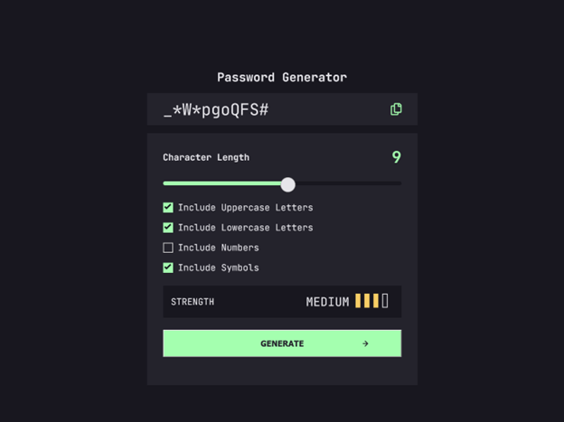
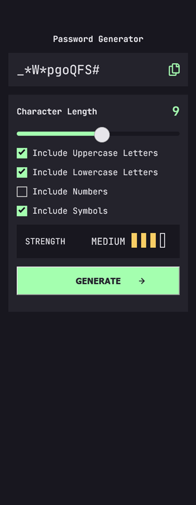

# Frontend Mentor - Password generator app solution

This is a solution to the [Password generator app challenge on Frontend Mentor](https://www.frontendmentor.io/challenges/password-generator-app-Mr8CLycqjh). Frontend Mentor challenges help you improve your coding skills by building realistic projects. 

## Overview

### The challenge

Users should be able to:

- Generate a password based on the selected inclusion options
- Copy the generated password to the computer's clipboard
- See a strength rating for their generated password
- View the optimal layout for the interface depending on their device's screen size
- See hover and focus states for all interactive elements on the page

### Screenshot

### Links

- Solution URL: [https://github.com/toshirokubota/password-generator-app](https://github.com/toshirokubota/password-generator-app)
- Live Site URL: [https://toshirokubota.github.io/password-generator-app/](https://toshirokubota.github.io/password-generator-app/)

## My process

### Built with

- Semantic HTML5 markup
- CSS custom properties
- Flexbox
- CSS Grid
- Mobile-first workflow

### What I learned

Through online search and help with AI, I was able to find a way to customize a range input bar and its thumb. There is still a glitch, however; when the browser is refreshed, the value of the range is set back to the default of 9 while the thumb remains at the previous position. I tried to figure out how to move the thumb programmatically, but I was not able to...

I was able to control the checkboxes with keyboard. In one of previous projects, I could not toggle a radio box with keys, and now I realized that I was using 'name' attribute instead of the id for the label's 'for' attribute. This time, I could make it work.

### Continued development

I want to learn about web accessibility and implement the frontend to handle it properly.

### Useful resources

## Author

- Frontend Mentor - [@toshirokubota](https://www.frontendmentor.io/profile/toshirokubota)

## Acknowledgments

